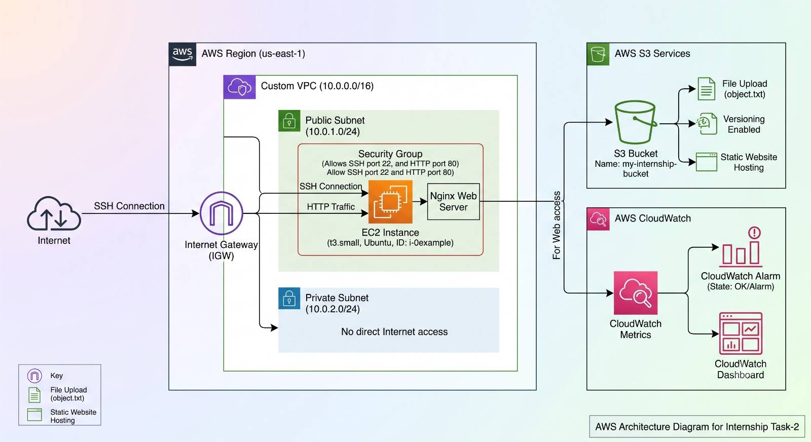

# AWS Cloud Infrastructure Provisioning

## Cloud & DevOps Internship — Task 2

This project documents the AWS cloud infrastructure provisioned for Cloud & DevOps Internship — Task 2.

The project covers Identity and Access Management (IAM), Virtual Private Cloud (VPC) networking, EC2 compute, Ubuntu server administration, Nginx web server deployment, Amazon S3 storage, CloudWatch monitoring, security configuration, architecture documentation, and AWS cost estimation.

---

## Objective

Design, deploy, secure, monitor, and document a basic AWS cloud infrastructure environment using core AWS services.

---

## Implemented Components

- AWS IAM
- Amazon VPC
- Public and private subnet configuration
- Internet Gateway
- Route Tables
- Security Groups
- Amazon EC2
- Ubuntu Server
- Nginx Web Server
- Amazon S3
- Amazon CloudWatch
- AWS Pricing Calculator

---

## AWS Region

**Region Code:** `eu-north-1`

**Region Name:** Stockholm

---

## IAM Configuration

The Task 2 IAM configuration includes users, groups, policies, roles, and MFA/security configuration as required for the lab environment.

### IAM Evidence

- [IAM Overview](screenshots/iam/iam-overview.png)
- [IAM Configuration](screenshots/iam/iam-configuration.png)
- [IAM Users](screenshots/iam/iam-users.jpeg)
- [DevOps Admin](screenshots/iam/iam-devops.png)
- [Cloud Intern](screenshots/iam/iam-cloud-intern.png)

---

## Network Configuration

The AWS networking environment includes a custom VPC, subnet configuration, Internet Gateway, route tables, and Security Groups.

### VPC Evidence

- [VPC Configuration](screenshots/vpc/vpc-configuration.jpeg)
- [Internet Gateway](screenshots/vpc/internet-gateway.jpeg)
- [Route Table](screenshots/vpc/route-table.jpeg)
- [Security Group Evidence](screenshots/security-groups/security-group.jpeg)

---

## Compute and Web Server

An Ubuntu EC2 instance was deployed as the compute resource for the project.

### EC2 Evidence

- [EC2 Configuration](screenshots/ec2/ec2-configuration.jpeg)
- [EC2 Instances](screenshots/ec2/ec2-instances.jpeg)
- [SSH Connection](screenshots/ec2/ssh-connection.jpeg)
- [Nginx Web Server](screenshots/ec2/nginx-web-server.jpeg)

---

## Amazon S3 Storage

Amazon S3 was configured for cloud object storage and static website-related evidence.

### S3 Evidence

- [S3 Buckets](screenshots/s3/buckets.jpeg)
- [S3 Configuration](screenshots/s3/s3-configuration.jpeg)
- [Company Static Site](screenshots/s3/company-static-site.jpeg)
- [S3 Company Static Site](screenshots/s3/s3-company-static-site.jpeg)
- [S3 Site](screenshots/s3/s3-site.jpeg)

---

## CloudWatch Monitoring

Amazon CloudWatch was configured for monitoring the EC2 infrastructure.

### CloudWatch Evidence

- [CloudWatch Overview](screenshots/cloudwatch/cloudwatch-overview.jpeg)
- [CloudWatch Graph](screenshots/cloudwatch/cloudwatch-graph.jpeg)
- [CloudWatch Alarms](screenshots/cloudwatch/cloudwatch-alarms.jpeg)
- [CloudWatch Alarm](screenshots/cloudwatch/cloudwatch-alarm.jpeg)

---

## AWS Architecture

The AWS architecture diagram for the Task 2 infrastructure is included below.



---

## Cost Estimation

AWS Pricing Calculator evidence is included in the `cost/` directory.

### Cost Evidence

- [Pricing Calculator](cost/pricing-calculator.jpeg)
- [Pricing Estimate](cost/pricing-estimate.jpeg)
- [Pricing Overview](cost/pricing-overview.jpeg)
- [Pricing Payment](cost/pricing-payment.jpeg)
- [Cost Estimation Report](cost/cost-estimation-report.pdf)

Actual AWS charges may vary depending on usage, storage, data transfer, pricing changes, and applicable Free Tier eligibility.

---

## Reports

- [Infrastructure Report](docs/infrastructure-report.pdf)
- [Cost Estimation Report](cost/cost-estimation-report.pdf)

---

## Repository Structure

```text
Cloud-DevOps-Internship-Task-2/
│
├── architecture/
│   └── aws-architecture.jpeg
│
├── cost/
│   ├── pricing-calculator.jpeg
│   ├── pricing-estimate.jpeg
│   ├── pricing-overview.jpeg
│   └── pricing-payment.jpeg
│
├── deployment/
│   └── deployment-documentation.md
│
├── docs/
│
├── evidence/
│   └── evidence-index.md
│
├── screenshots/
│   ├── cloudwatch/
│   ├── ec2/
│   ├── iam/
│   ├── s3/
│   ├── security-groups/
│   └── vpc/
│
├── .gitignore
└── README.md
